# Technical Architecture Overview
## Cloudflare Documentation System

This document provides a comprehensive technical architecture overview of the Cloudflare documentation system, a hybrid static site generator and edge worker application.

---

## Executive Summary

The Cloudflare documentation system is a sophisticated technical documentation platform built using:
- **Astro 5.x** as the static site generator framework
- **Starlight** theme for documentation-focused UI/UX
- **MDX (Markdown + JSX)** for rich content authoring
- **Cloudflare Workers** for edge-deployed request handling
- **Cloudflare R2** for object storage
- **TypeScript** for type-safe development
- **Zod** for runtime schema validation

The system follows a **Build-Time Generation + Edge-Time Enhancement** architecture pattern.

---

## System Architecture

### High-Level Component Diagram

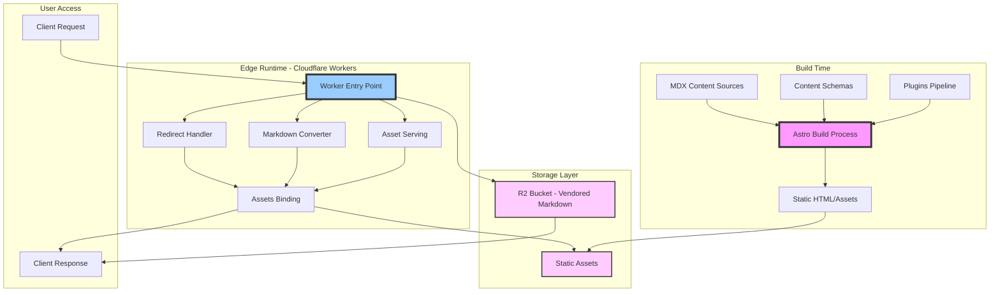

### System Boundaries

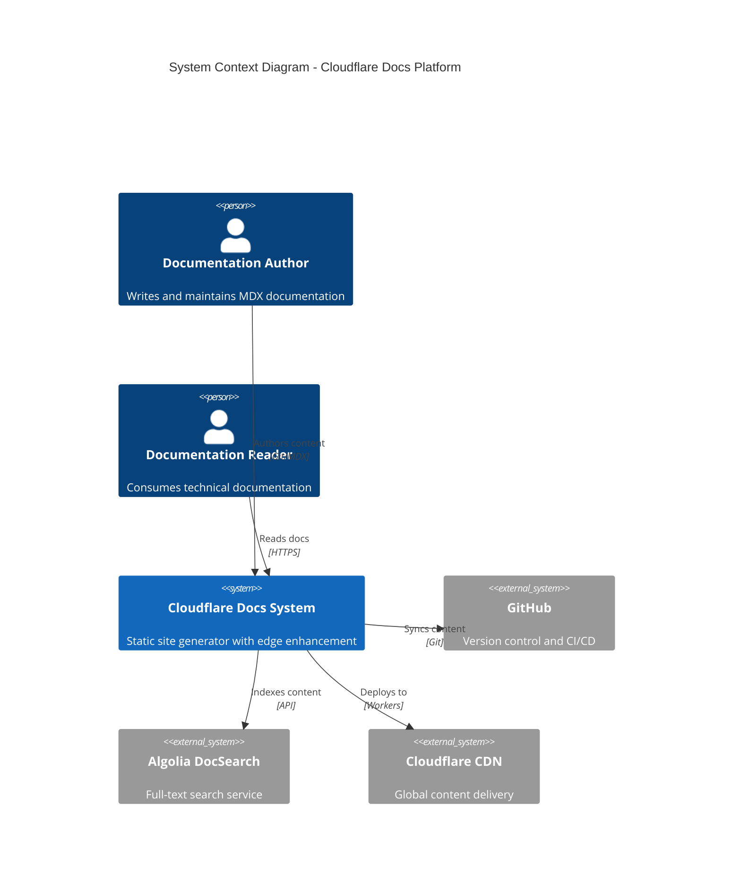

---

## Architecture Layers

### 1. Content Layer

The content layer consists of structured MDX files organized by product/topic:

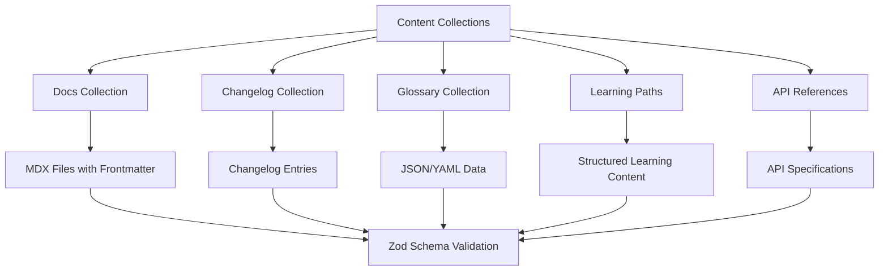

**Key Content Types:**
- `docs`: Primary documentation pages (5304+ MDX files)
- `changelog`: Product changelog entries
- `glossary`: Technical term definitions
- `learning-paths`: Structured learning content
- `videos`, `apps`, `release-notes`: Supplementary content
- `partials`: Reusable content fragments
- `fields`: API field definitions

### 2. Build Layer (Astro Pipeline)

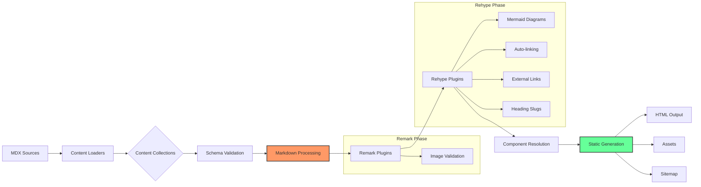

**Build Pipeline Components:**

1. **Content Loaders** (Astro Loaders API)
   - `docsLoader()`: Loads documentation MDX files
   - `glob()`: Pattern-based file loading
   - `file()`: Single file loading (e.g., videos.yaml)

2. **Schema Validation Layer** (Zod)
   - Runtime type checking
   - Frontmatter validation
   - Data structure enforcement

3. **Markdown Processing Pipeline**
   - **Remark plugins**: AST transformations at markdown level
   - **Rehype plugins**: AST transformations at HTML level
   - Custom plugins for Mermaid, autolinks, external links

4. **Component Resolution**
   - React component rendering
   - Starlight component overrides
   - Custom documentation components

### 3. Edge Runtime Layer (Cloudflare Workers)

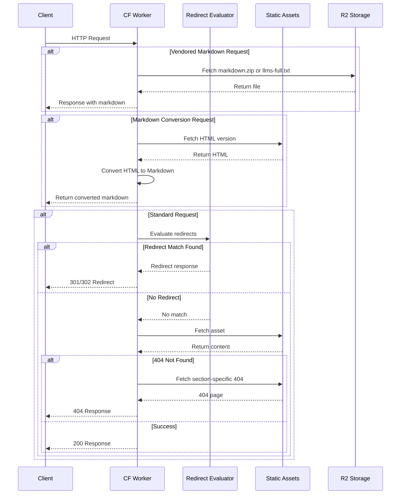

**Worker Responsibilities:**

1. **Redirect Management**: Pattern-based URL redirects
2. **Markdown Serving**: 
   - Vendored markdown from R2
   - On-demand HTML→Markdown conversion
3. **Asset Serving**: Static files from build output
4. **Custom 404 Handling**: Section-specific error pages

### 4. Data Flow Architecture

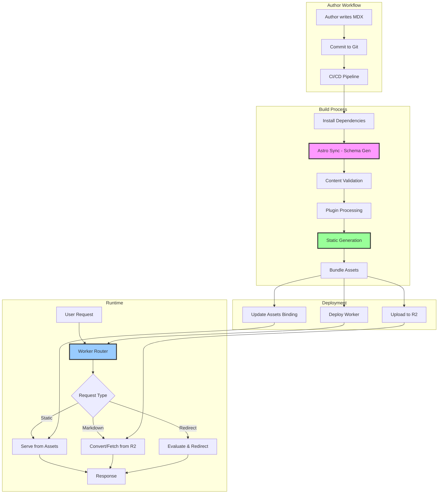

---

## Integration Points

### External Services Integration

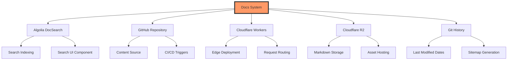

**Integration Contracts:**

1. **Algolia DocSearch**
   - Purpose: Full-text search capability
   - Interface: JavaScript client library
   - Data flow: Build-time indexing, runtime search queries

2. **GitHub**
   - Purpose: Version control, CI/CD, last-modified tracking
   - Interface: Git CLI, GitHub Actions
   - Data flow: Bidirectional sync, metadata extraction

3. **Cloudflare Workers**
   - Purpose: Edge compute platform
   - Interface: Worker API, Service bindings
   - Data flow: Request/response handling, asset serving

4. **Cloudflare R2**
   - Purpose: Object storage for vendored content
   - Interface: R2 binding API
   - Data flow: Upload at build time, fetch at runtime

---

## Plugin Architecture

### Markdown Processing Pipeline

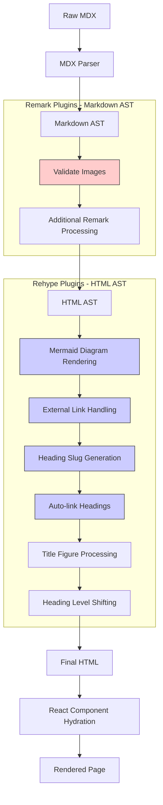

---

## Data Schema Architecture

### Content Collection Schemas

The system uses **Zod** for runtime schema validation. Each content collection has a defined schema:

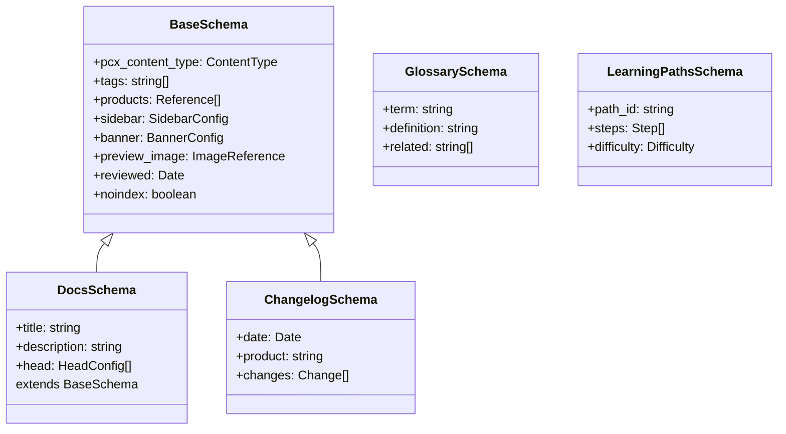

### Key Schema Components

1. **Content Types** (pcx_content_type):
   - concept, tutorial, how-to, reference
   - configuration, troubleshooting, faq
   - integration-guide, example
   - changelog, release-notes

2. **Sidebar Configuration**:
   - order: number
   - badge: string
   - hidden: boolean
   - icon: IconReference

3. **Product References**:
   - Cross-references to product definitions
   - Used for filtering and organization

---

## Deployment Architecture

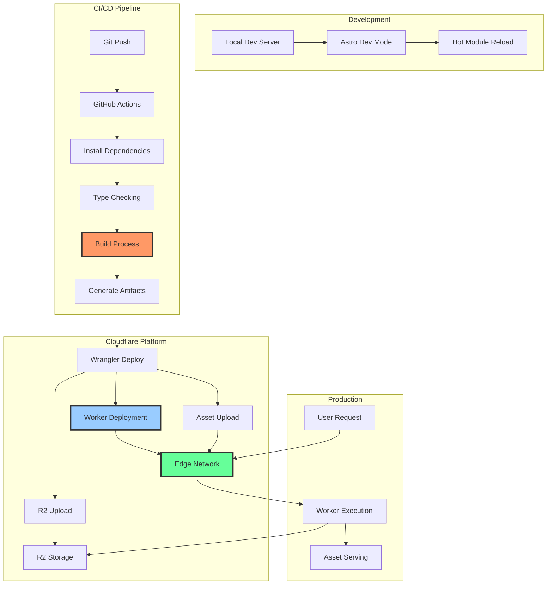

---

## Key Technologies & Patterns

### Technology Stack Summary

| Layer | Technology | Purpose |
|-------|-----------|---------|
| **Framework** | Astro 5.x | Static site generation |
| **Content** | MDX | Markdown with JSX components |
| **UI Framework** | React 19.x | Interactive components |
| **Theme** | Starlight | Documentation-focused UI |
| **Runtime** | Cloudflare Workers | Edge compute |
| **Storage** | Cloudflare R2 | Object storage |
| **Type System** | TypeScript 5.x | Static typing |
| **Schema Validation** | Zod | Runtime validation |
| **Markdown Processing** | Remark/Rehype | AST transformations |
| **Search** | Algolia DocSearch | Full-text search |
| **Package Manager** | npm | Dependency management |
| **Build Tool** | Vite | Bundling and dev server |

### Architectural Patterns

1. **Static Site Generation (SSG)**
   - Pre-render all pages at build time
   - Optimize for performance and SEO

2. **Content Collections**
   - Type-safe content management
   - Schema-driven validation
   - Automatic TypeScript types

3. **Plugin Architecture**
   - Remark/Rehype plugin chains
   - Extensible markdown processing
   - Custom transformation logic

4. **Edge Enhancement**
   - Dynamic features at the edge
   - Zero cold start (Workers)
   - Global distribution

5. **Service Bindings**
   - Assets binding for static files
   - R2 binding for object storage
   - Type-safe environment

---

## Performance Characteristics

### Build Performance

- **Content Files**: 5304+ MDX files
- **Build Time**: ~10-15 minutes (typical)
- **Memory Requirements**: 6GB+ (Node.js heap)
- **Type Generation**: ~11.6 seconds

### Runtime Performance

- **Worker Execution**: < 5ms typical
- **Asset Serving**: Edge-cached
- **First Contentful Paint**: < 1s
- **Time to Interactive**: < 2s

### Scalability

- **Edge Locations**: 300+ (Cloudflare network)
- **Concurrent Requests**: Unlimited (Worker auto-scaling)
- **Storage**: Unlimited (R2)
- **Bandwidth**: Unmetered (Workers)

---

## Security Architecture

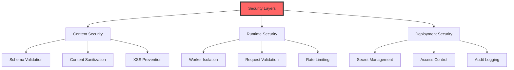

**Security Measures:**

1. **Content Validation**: Zod schemas prevent malformed content
2. **XSS Prevention**: DOMPurify for user-generated content
3. **Worker Isolation**: V8 isolate per request
4. **HTTPS Only**: All traffic encrypted
5. **CORS Configuration**: Controlled cross-origin access

---

## Monitoring & Observability

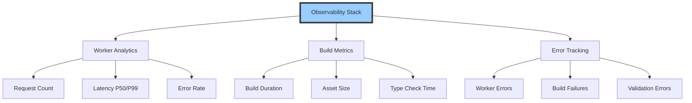

Configuration in `wrangler.toml`:
```toml
[observability]
enabled = true
```

---

## Future Considerations

1. **Incremental Builds**: Reduce build times for large documentation sets
2. **Edge Caching**: Improved cache strategies for dynamic content
3. **Real-time Updates**: WebSocket support for live documentation updates
4. **Multi-language Support**: I18n infrastructure already in place
5. **A/B Testing**: Edge-based experimentation framework

---

## References

- **Repository**: cogpy/cogflare-docs
- **Astro Documentation**: https://astro.build
- **Starlight Theme**: https://starlight.astro.build
- **Cloudflare Workers**: https://workers.cloudflare.com
- **MDX**: https://mdxjs.com

---

*This architecture overview serves as the foundation for the formal Z++ specifications that follow.*
